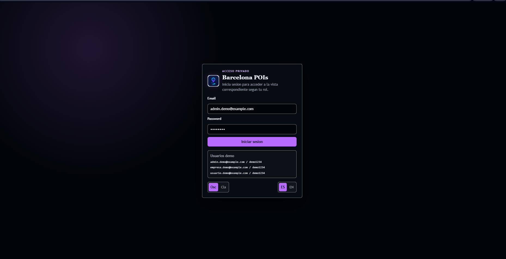
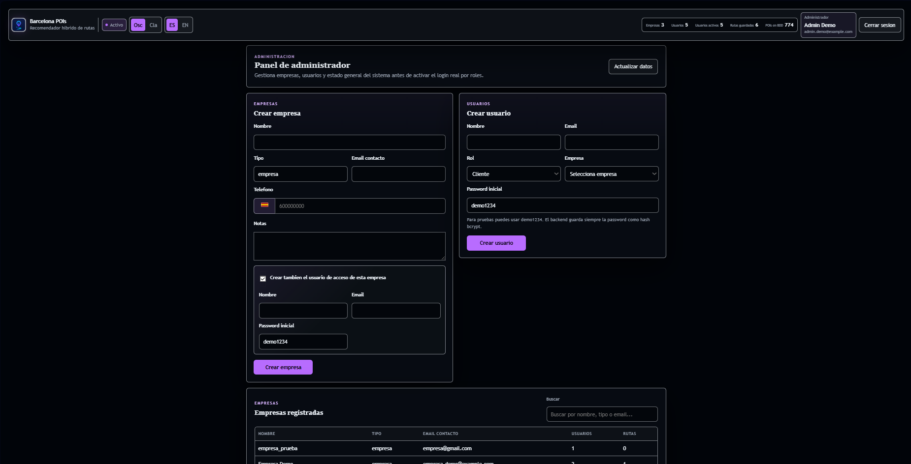
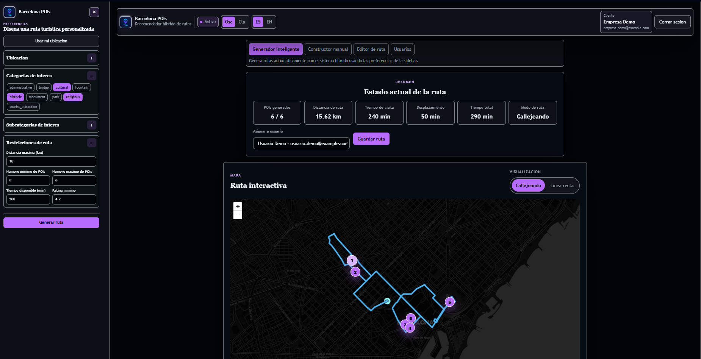
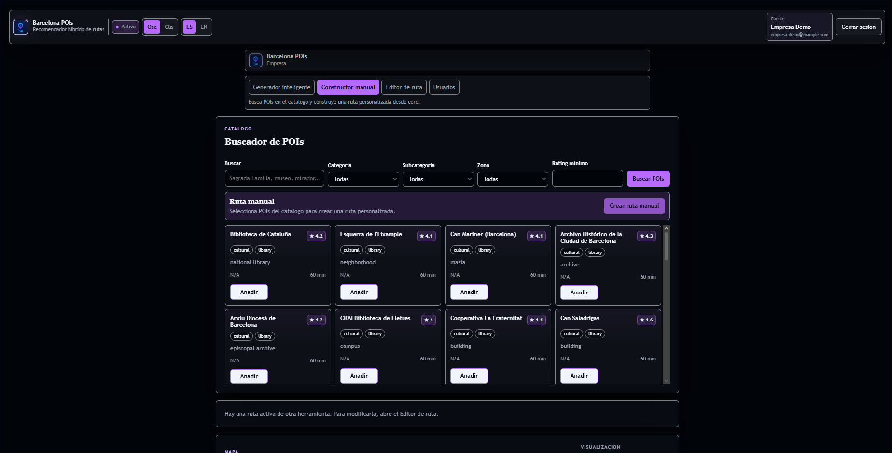
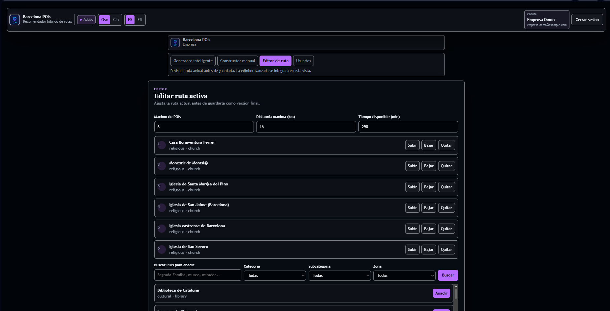
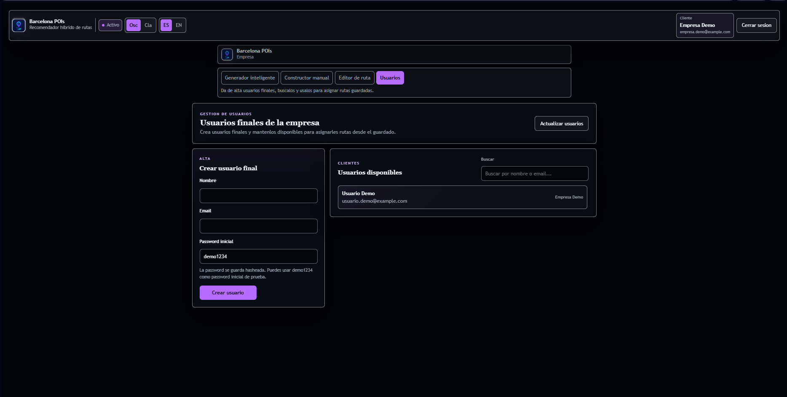
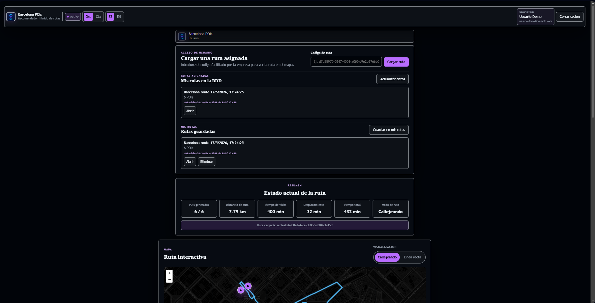
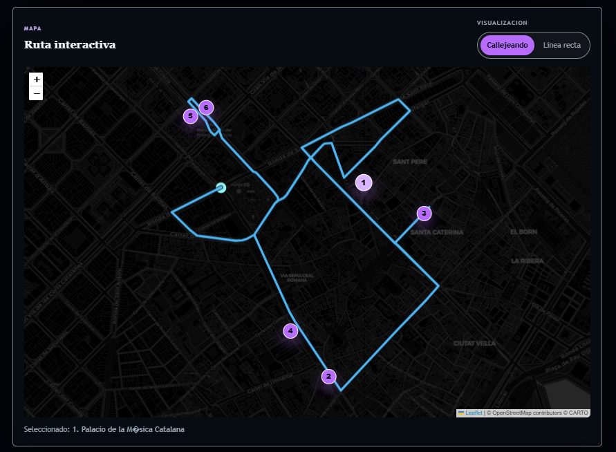
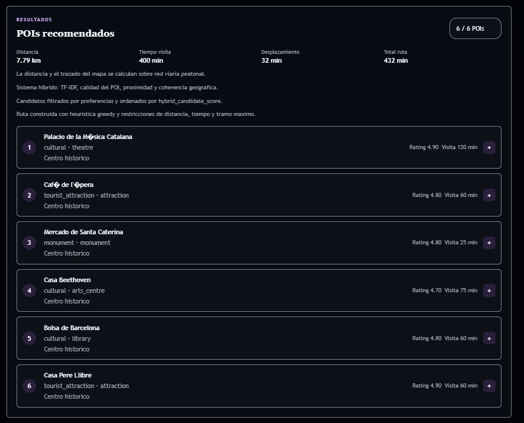

# Sistema híbrido de recomendación de rutas de POIs en Barcelona

Este repositorio contiene el desarrollo de mi Trabajo Fin de Máster, centrado en la creación de un sistema inteligente de recomendación de rutas personalizadas sobre puntos de interés turísticos en Barcelona.

El problema que se busca resolver no consiste únicamente en recomendar lugares individuales de forma aislada, sino en construir rutas completas, coherentes y viables para un usuario real de manera rápida, eficaz y escalonada. En un contexto turístico, una buena recomendación no depende solo de que un POI sea popular o tenga una buena valoración, sino también de que encaje con los intereses del usuario, esté situado en una zona razonable, pueda visitarse dentro del tiempo disponible y forme parte de un recorrido lógico.

Por este motivo, el proyecto plantea un sistema de recomendación híbrido que combina diferentes señales:

- similitud temática entre las preferencias del usuario y los POIs, mediante técnicas de procesamiento de texto como TF-IDF y similitud coseno;
- calidad y relevancia de cada POI, usando métricas como rating, score y señales de confianza;
- proximidad geográfica respecto al punto de inicio y entre los propios POIs;
- coherencia espacial mediante agrupación geográfica de los puntos de interés;
- restricciones prácticas introducidas por el usuario, como distancia máxima, tiempo disponible, número mínimo y máximo de POIs, categorías, subcategorías o zonas de la ciudad.

El objetivo final es pasar de un modelo experimental a una aplicación funcional como MVP. Para ello, el sistema no se queda únicamente en notebooks de análisis, sino que integra el recomendador híbrido dentro de una arquitectura web completa formada por frontend, backend, motor Python de recomendación y base de datos MySQL.

La aplicación permite que una empresa o entidad turística pueda generar rutas inteligentes, construir rutas manualmente, editar rutas existentes, guardar rutas en base de datos y asignarlas a usuarios finales. A su vez, el usuario final puede iniciar sesión, consultar sus rutas asignadas y visualizarlas en un mapa interactivo junto con el resumen de la ruta y el detalle de los POIs.

En resumen, el proyecto aborda el problema de la planificación personalizada de rutas turísticas combinando técnicas de machine learning, análisis geoespacial, optimización heurística, desarrollo backend, frontend y persistencia de datos. El resultado es un sistema híbrido orientado a un caso de uso real: recomendar rutas turísticas útiles, personalizadas y visualmente interpretables en la ciudad de Barcelona.

## Estado actual del proyecto

El proyecto ya tiene una primera version funcional de extremo a extremo:

```text
usuario/empresa/admin
  -> frontend React
  -> backend Node.js
  -> motor Python del recomendador hibrido
  -> dataset hibrido enriquecido
  -> ruta en mapa + persistencia en MySQL
```

Actualmente incluye:

- recomendador hibrido real integrado con la web
- generador inteligente de rutas
- constructor manual de rutas
- editor de rutas
- buscador/catalogo de POIs
- guardado y recuperacion de rutas en MySQL
- panel de administrador para empresas y usuarios
- login funcional con JWT
- alta de usuarios finales desde la vista Empresa
- asignacion de rutas a usuarios finales
- vista Usuario con rutas asignadas desde MySQL
- importacion de POIs a MySQL
- interfaz responsive con modo claro/oscuro e idioma ES/EN

El login JWT ya esta activo. Cada usuario entra con su email/password y la app muestra automaticamente la vista correspondiente a su rol.

## Estructura principal

```text
.
|-- data/
|   |-- pois_barcelona_hibrido.parquet
|   |-- pois_barcelona_hibrido.csv
|   |-- pois_barcelona_procesados.parquet
|   `-- pois_barcelona_procesados.csv
|
|-- database/
|   |-- 01_create_database.sql
|   |-- 02_create_tables.sql
|   |-- 03_seed_initial_data.sql
|   |-- 04_seed_auth_demo_users.sql
|   |-- import_pois_to_mysql.py
|   `-- README.md
|
|-- ml_service/
|   `-- recommend_route.py
|
|-- modelo/
|   |-- 01_Baseline_Recommender.ipynb
|   |-- 02_Content_Based_Recommender.ipynb
|   |-- 03_Geographic_Clustering.ipynb
|   |-- 04_Ranking_Adicional.ipynb
|   |-- 05_Route_Optimization_Greedy.ipynb
|   `-- 06_Hybrid_Recommender_Route_System.ipynb
|
|-- project-root/
|   |-- backend/
|   |-- frontend/
|   |-- docs/
|   `-- README.md
|
|-- src/
|   `-- build_hybrid_dataset.py
|
|-- start-dev.ps1
`-- README.md
```

## Metodologia

El desarrollo se ha hecho de forma incremental:

```text
limpieza y enriquecimiento de datos
-> baseline de recomendacion
-> recomendador basado en contenido con TF-IDF
-> clustering geografico
-> ranking por calidad/relevancia
-> optimizacion greedy de rutas
-> sistema hibrido final
-> integracion backend/frontend
-> persistencia MySQL
-> panel admin y gestion inicial de usuarios
```

Los notebooks documentan la parte experimental. La version integrada en la web esta en:

```text
ml_service/recommend_route.py
```

## Sistema hibrido

El recomendador tiene dos capas:

1. Seleccion de candidatos:
   - TF-IDF sobre `content_base`
   - similitud coseno
   - filtros por categorias, subcategorias, rating, zonas y restricciones
   - calidad mediante `quality_signal`
   - proximidad al origen

2. Construccion de ruta:
   - heuristica greedy
   - distancia maxima total
   - tiempo maximo disponible
   - distancia maxima por tramo
   - numero minimo/maximo de POIs
   - coherencia geografica con `cluster_geo`

El dataset principal usado por el motor es:

```text
data/pois_barcelona_hibrido.parquet
```

El CSV equivalente se mantiene como alternativa:

```text
data/pois_barcelona_hibrido.csv
```

El dataset hibrido se genera con:

```powershell
python src/build_hybrid_dataset.py
```

Este script no se ejecuta cada vez. Solo se vuelve a ejecutar si cambian los datos base o la logica de enriquecimiento.

## Aplicacion web

La aplicacion esta en:

```text
project-root/
```

Tiene tres vistas funcionales:

- **Admin**: gestion de empresas, usuarios, estado y datos generales.
- **Empresa**: generador inteligente, constructor manual, editor de rutas, alta de usuarios finales y asignacion de rutas.
- **Usuario**: consulta de rutas asignadas desde MySQL, carga por codigo publico y acceso rapido a rutas guardadas localmente.

Estas vistas se seleccionan automaticamente segun el rol tras login.

## Resultados principales

El proyecto consigue pasar de un sistema experimental basado en notebooks a una aplicacion web funcional conectada con un recomendador hibrido real.

Resultados destacados:

- generacion de rutas completas, no solo recomendacion de POIs aislados
- integracion de TF-IDF, similitud coseno, calidad del POI, proximidad geografica y restricciones del usuario
- construccion de rutas mediante heuristica greedy con control de distancia, tiempo y numero de POIs
- uso de clusters/zonas de Barcelona para mejorar la coherencia geografica de las rutas
- conexion real entre frontend, backend Node.js, motor Python y dataset hibrido
- persistencia en MySQL de usuarios, empresas, POIs importados y rutas generadas
- login con JWT y roles diferenciados para administrador, empresa y usuario final
- visualizacion de rutas en mapa interactivo con resumen y detalle de POIs

Ejemplo de resultado obtenido por el sistema:

```text
POIs generados: 6
Distancia de ruta: 7.79 km
Tiempo de visita: 400 min
Desplazamiento estimado: 32 min
Tiempo total: 432 min
Modo de ruta: callejeando
```

La conclusion principal es que el enfoque hibrido permite generar rutas mas utiles que un ranking simple, porque combina relevancia tematica, calidad, cercania y viabilidad practica dentro de una misma experiencia.

## Capturas de la aplicacion

### Login

Pantalla de acceso con autenticacion por email/password, seleccion de tema e idioma.



### Panel de administrador

Vista de administracion para gestionar empresas, usuarios, estado general del sistema y metricas principales.



### Generador inteligente de rutas

Vista de empresa conectada al sistema hibrido. Permite introducir preferencias, generar una ruta, ver resumen, mapa y guardar/asignar la ruta.



### Constructor manual de POIs

Catalogo de POIs con filtros por busqueda, categoria, subcategoria, zona y rating para construir rutas manuales.



### Editor de ruta

Vista para modificar una ruta activa: ajustar restricciones, quitar POIs, cambiar el orden y anadir nuevos POIs desde el catalogo.



### Gestion de usuarios de empresa

Pantalla para que una empresa cree usuarios finales y los tenga disponibles para asignarles rutas guardadas.



### Vista de usuario final

Vista donde el usuario final puede consultar rutas asignadas desde MySQL, cargar rutas por codigo publico y guardarlas como acceso rapido.



### Mapa y resultados

Mapa interactivo con trazado peatonal y POIs numerados de la ruta.



Listado de POIs recomendados con resumen de distancia, tiempos y detalle de cada punto de interes.



## Backend

Carpeta:

```text
project-root/backend
```

Tecnologias:

- Node.js
- Express
- MySQL con `mysql2`
- `bcryptjs` para guardar passwords hasheadas
- `jsonwebtoken` para sesiones JWT
- comunicacion interna con Python

Endpoints principales:

```text
GET    /api/health
GET    /api/categories
GET    /api/pois
POST   /api/recommend-route
POST   /api/routes
GET    /api/routes/my
GET    /api/routes/:publicId
GET    /api/admin
POST   /api/admin/clients
POST   /api/admin/users
PATCH  /api/admin/users/:userId/status
POST   /api/auth/login
GET    /api/auth/me
GET    /api/company/users
POST   /api/company/users
```

## Frontend

Carpeta:

```text
project-root/frontend
```

Tecnologias:

- React
- Vite
- Leaflet
- React Leaflet

Funcionalidades:

- mapa interactivo
- sidebar de preferencias
- modo claro/oscuro
- idioma ES/EN
- generador inteligente
- constructor manual
- editor de rutas
- buscador de POIs
- vista de usuario para recuperar rutas
- panel admin responsive
- panel de empresa para crear usuarios finales
- asignacion de rutas a usuarios finales
- consulta de rutas asignadas desde la vista usuario

## Base de datos MySQL

Carpeta:

```text
database/
```

Uso actual:

- roles
- empresas/clientes
- usuarios
- POIs importados desde el dataset hibrido
- rutas guardadas
- asignacion de rutas a usuarios finales
- POIs de cada ruta y su orden
- JSON con preferencias, resumen, ruta y navegacion

Para el MVP, el recomendador sigue leyendo el parquet/CSV hibrido. MySQL se usa para persistencia y gestion de usuarios/rutas.

Orden recomendado:

```text
01_create_database.sql
02_create_tables.sql
03_seed_initial_data.sql
04_seed_auth_demo_users.sql
python database/import_pois_to_mysql.py
```

Usuarios demo preparados:

```text
admin.demo@example.com    / demo1234
empresa.demo@example.com  / demo1234
usuario.demo@example.com  / demo1234
```

La password se guarda como hash bcrypt en `users.password_hash`.

## Dependencias

### Python

Version usada en el entorno Conda `master_ds_clean`:

```text
Python 3.11.15
```

Librerias principales:

```text
pandas==3.0.2
numpy==2.4.4
scikit-learn==1.8.0
pyarrow==16.1.0
matplotlib==3.10.8
notebook==7.5.5
mysql-connector-python==9.7.0
```

Instalacion orientativa:

```powershell
pip install pandas numpy scikit-learn pyarrow matplotlib jupyter notebook mysql-connector-python
```

### Backend Node.js

Versiones usadas:

```text
Node.js v22.19.0
npm 10.9.3
```

Dependencias actuales:

```text
bcryptjs 3.0.3
cors 2.8.5
csv-parse 5.5.6
dotenv 16.4.5
express 4.21.2
jsonwebtoken 9.0.3
mysql2 3.22.3
```

Instalacion:

```powershell
cd project-root/backend
npm install
```

### Frontend React

Dependencias actuales:

```text
react 18.3.1
react-dom 18.3.1
leaflet 1.9.4
react-leaflet 4.2.1
vite 5.4.11
@vitejs/plugin-react 4.3.4
```

Instalacion:

```powershell
cd project-root/frontend
npm install
```

## Ejecucion local

Para una instalacion desde cero, usar la guia completa:

```text
GUIA_EJECUCION_LOCAL.md
```

Desde la raiz del repositorio:

```powershell
.\start-dev.ps1
```

Si PowerShell bloquea el script:

```powershell
powershell -ExecutionPolicy Bypass -File .\start-dev.ps1
```

En Git Bash:

```bash
powershell.exe -ExecutionPolicy Bypass -File ./start-dev.ps1
```

URLs:

```text
Backend:  http://localhost:4000
Frontend: http://localhost:5173
```

Comprobar backend:

```text
http://localhost:4000/api/health
```

## Ejecucion manual

Backend:

```powershell
cd project-root/backend
$env:PYTHON_BIN="C:\Users\User\miniconda3\envs\master_ds_clean\python.exe"
npm run dev
```

Frontend:

```powershell
cd project-root/frontend
npm run dev
```

## Documentacion adicional

En `project-root/docs/` hay documentos de apoyo para defensa y explicacion:

```text
apis_del_proyecto.txt
auditoria_notebooks_modelado.md
explicacion_modelo_hibrido_final.txt
flujo_usuario_modelo_hibrido_web.txt
historial_trabajo_2026-04-27.txt
integracion_modelo_hibrido_web.txt
preguntas_frecuentes_defensa.txt
uso_ml_en_el_recomendador.txt
```

## Siguientes pasos

Los siguientes pasos naturales son:

- extender la proteccion por rol al resto de endpoints privados
- mejorar la gestion/listado de rutas desde la vista Empresa
- anadir busqueda avanzada de rutas guardadas
- anadir tests de backend y recomendador
- mejorar explicabilidad de POIs con textos enriquecidos

## Idea principal

El valor del proyecto esta en unir data science, machine learning, optimizacion heuristica, backend, frontend y persistencia para pasar de un modelo experimental a una aplicacion web funcional de recomendacion de rutas.

Proyecto academico desarrollado durante el Master en Data Science e Inteligencia Artificial de Evolve.
